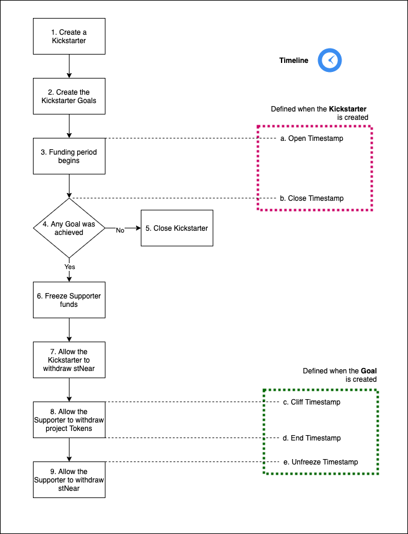
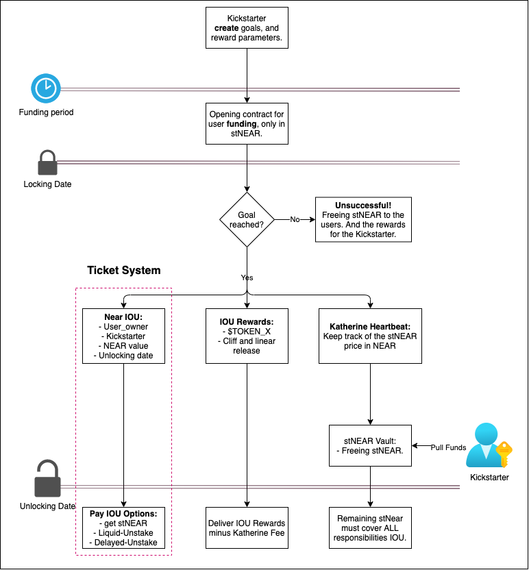
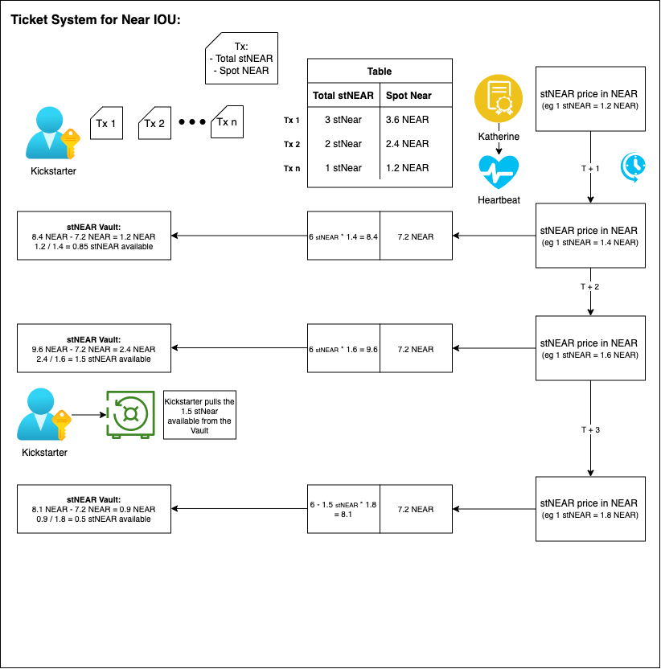

# Katherine Fundraising

Allow any project to bootstrap liquidity through staking on Meta Pool.

## Project Definition

From now on, to be consistent with the naming convention in the code, we'll name the Projects as **Kickstarter**.

A Kickstarter could use the Katherine Fundraising Contract to raise funds leveraging the yield generated by staking Near tokens in Meta Pool.

The Kickstarter life cycle:



These are the functions to interact with Katherine.

### 1. Create a Kickstarter

To create a Kickstarter, Katherine admin must call:

```rust
fn create_kickstarter(
    name: String,
    slug: String,
    owner_id: AccountId,
    open_timestamp: EpochMillis,
    close_timestamp: EpochMillis,
    token_contract_address: AccountId,
) -> KickstarterIdJSON
```

An example using the terminal:

```sh
NEAR_ENV=testnet near call $CONTRACT_NAME create_kickstarter '{"name": "'$KICKSTARTER_NAME'", "slug": "'$KICKSTARTER_SLUG'", "owner_id": "'$KICKSTARTER_OWNER_ID'", "open_timestamp": '$KICKSTARTER_OPEN_DATE', "close_timestamp": '$KICKSTARTER_CLOSE_DATE', "token_contract_address": "'$KICKSTARTER_TOKEN_ADDRESS'"}' --accountId $KATHERINE_OWNER_ID
```

The returned value is the **Kickstarter Id**.

### 2. Create the Kickstarter Goals

To create one of the multiple goals, the MAX number of goals is 5:

```rust
fn create_goal(
    kickstarter_id: KickstarterId,
    name: String,
    desired_amount: BalanceJSON,
    unfreeze_timestamp: EpochMillis,
    tokens_to_release: BalanceJSON,
    cliff_timestamp: EpochMillis,
    end_timestamp: EpochMillis,
) -> GoalId
```

An example using the terminal:

```sh
NEAR_ENV=testnet near call $CONTRACT_NAME create_goal '{"kickstarter_id": '$KICKSTARTER_ID', "name": "'$GOAL_1_NAME'", "desired_amount": "'$GOAL_1_DESIRED_AMOUNT'", "unfreeze_timestamp": '$GOAL_1_UNFREEZE_DATE', "tokens_to_release": "'$GOAL_1_TOKENS_TO_RELEASE'", "cliff_timestamp": '$GOAL_1_CLIFF_DATE', "end_timestamp": '$GOAL_1_END_DATE'}' --accountId $KICKSTARTER_OWNER_ID
```

The returned value is the **Goal Id**.

The Kickstarter owner could detele a goal, before the funding period is open.

```rust
fn delete_last_goal(kickstarter_id: KickstarterId)
```

### 3. Funding period begins

### 4. Evaluate Goal

### 5. Close unsuccessful Kickstarter

### 6. Freeze Supporter funds

### 7. Allow the Kickstarter to withdraw stNear

### 8. Allow the Supporter to withdraw project Tokens

### 9. Allow the Supporter to withdraw stNear


Contract Logic:



The Ticket system:



## Important Assumptions

- Supporters after doing a deposit to a Kickstarter, could recover the funds before they get locked.
- Goal 1 gets all the stNEAR obtained if the Goal 2 is not met.

## Contract Functions

When a user deposits to fund a project, all of their stNEAR tokens are `ready_to_fund`.

- If the project is unsuccessful, fund are moved from `ready_to_fund` to `available`.
- If the project is successful, funds are moved from `ready_to_fund` to `locked`. When the locking period ends, fund are move backed from `locked` to `available`. Note that less stNEAR will move back, however the value in NEAR will be the same.


```text
create_project() - Kickstarter
deposit_and_stake() - User

user_withdrawa() - User
get_back_rewards() - Kickstarter
```


## Build the contract

Run the `build.sh` script.

```sh
make build
```

## Deploy the contract in Testnet

https://docs.near.org/docs/tools/near-cli#near-deploy

### Initialize contract

```sh
NEAR_ACCOUNT="imcsk8.testnet" make publish-dev-init
```

```sh
export NEAR_ENV=testnet

rm -rf neardev/ && near dev-deploy --wasmFile res/katherine_fundraising_contract.wasm --initFunction new --initArgs '{"owner_id": "jomsox.testnet", "staking_goal": 10}' && export $(grep -v '^#' neardev/dev-account.env | xargs)
```

A new account will be created for the contract. Note how the last command exported CONTRACT_NAME.

### Upload changes to the contract
```sh
NEAR_ACCOUNT="imcsk8.testnet" make publish-dev
```

## Deposit to the contract

https://docs.near.org/docs/tools/near-cli#near-call

Deposit to the testnet contract using a test multiple test accounts:

```sh
near call $CONTRACT_NAME deposit_and_stake --accountId jomsox.testnet --deposit 2
near call $CONTRACT_NAME deposit_and_stake --accountId huxley.testnet --deposit 11 
```

## View the contract total available amount

```sh
near view $CONTRACT_NAME get_contract_total_available '{}'
```


near call $CONTRACT_NAME evaluate_at_due --accountId huxley.testnet 

## Kickstarters

### Create kickstarter

```sh
near call dev-1645463337931-68562022007060 create_kickstarter '{"name": "test kickstarter 2", "slug": "test-kickstarter2", "finish_timestamp": 0, "open_timestamp": 0, "close_timestamp": 0, "vesting_timestamp": 0, "cliff_timestamp": 0}'  --accountId imcsk8.testnet 
```

### List kickstarters

```sh
near view dev-1645463427632-85695251757474 list_kickstarters --accountId imcsk8.testnet

```

## Deploy local Node

The `local_near` command is part of the Kurtosis development environment: https://docs.near.org/docs/tools/kurtosis-localnet.
To install the kurtosis CLI follow the installation documentation: https://docs.kurtosistech.com/installation.html

1. Build the contract

```sh
RUSTFLAGS='-C link-arg=-s' cargo +stable build --all --target wasm32-unknown-unknown --release
```

2. Deploy the contract in a local node

https://docs.near.org/docs/tools/near-cli#near-deploy

```sh
cd katherine-fundraising-contract

local_near deploy --accountId jomsox.test.near --wasmFile target/wasm32-unknown-unknown/release/katherine_fundraising_contract.wasm --initFunction new --initArgs '{"owner_id": "jomsox.test.near", "staking_goal": 10000}'
```

3. Deposit to the contract

https://docs.near.org/docs/tools/near-cli#near-call

```sh
local_near call jomsox.test.near deposit_and_stake --accountId jomsox.test.near --deposit 2
```

# References

* https://github.com/Narwallets/meta-pool
* https://docs.near.org/docs/tools/kurtosis-localnet
* https://docs.kurtosistech.com/installation.html