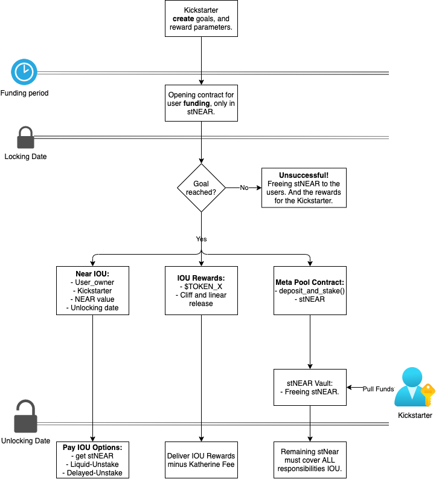

# Katherine Fundraising

Allow any project to bootstrap liquidity through staking on Meta Pool.

Contract Logic:



## Contract Functions

When a user deposits to fund a project, all of their stNEAR tokens are `ready_to_fund`.

- If the project is unsuccessful, fund are moved from `ready_to_fund` to `available`.
- If project is successful, funds are moved from `ready_to_fund` to `locked`. When the locking period ends, fund are move backed from `locked` to `available`. Note that less stNEAR will move back, however the value in NEAR will be the same.


```text
create_project() - Kickstarter
deposit_and_stake() - User

user_withdrawa() - User
get_back_rewards() - Kickstarter
```


## Build the contract

Run the `build.sh` script.

```sh
./build.sh
```

## Deploy the contract in Testnet

https://docs.near.org/docs/tools/near-cli#near-deploy

```sh
export NEAR_ENV=testnet

rm -rf neardev/ && near dev-deploy --wasmFile res/katherine_fundraising.wasm --initFunction new --initArgs '{"owner_id": "jomsox.testnet", "staking_goal": 10}' && export $(grep -v '^#' neardev/dev-account.env | xargs)
```

A new account will be created for the contract. Note how the last command exported CONTRACT_NAME.

## Deposit to the contract

https://docs.near.org/docs/tools/near-cli#near-call

Deposit to the testnet contract using a test multiple test accounts:

```sh
near call $CONTRACT_NAME deposit_and_stake --accountId jomsox.testnet --deposit 2
near call $CONTRACT_NAME deposit_and_stake --accountId huxley.testnet --deposit 11 
```

## View the contract total available amount

```sh
near view $CONTRACT_NAME get_contract_total_available '{}'
```


near call $CONTRACT_NAME evaluate_at_due --accountId huxley.testnet 


## Deploy local Node

The `local_near` command is part of the Kurtosis development environment: https://docs.near.org/docs/tools/kurtosis-localnet.

1. Build the contract

```sh
RUSTFLAGS='-C link-arg=-s' cargo +stable build --all --target wasm32-unknown-unknown --release
```

2. Deploy the contract in a local node

https://docs.near.org/docs/tools/near-cli#near-deploy

```sh
cd katherine-fundraising

local_near deploy --accountId jomsox.test.near --wasmFile target/wasm32-unknown-unknown/release/katherine_fundraising.wasm --initFunction new --initArgs '{"owner_id": "jomsox.test.near", "staking_goal": 10000}'
```

3. Deposit to the contract

https://docs.near.org/docs/tools/near-cli#near-call

```sh
local_near call jomsox.test.near deposit_and_stake --accountId jomsox.test.near --deposit 2
```